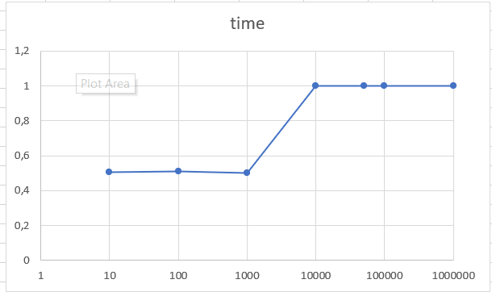

# Contacts database

*Goal: measure performance of a simple application in two scenarios -
with and without a SQL index*

# Step 1 - measure performance without an index

Run the main application with a small number of contacts (<100)
see various readme by languages on how to do that.

You'll get an error message because the code is not complete, so start by implementing the `TODO` comments.

Create a document matching the size of the database with the duration of
the query (in milliseconds):

| size         | time (in ms)            |
|--------------|-------------------------|
| 10           | 0.506    ms    0.506 ms |
| 100          | 0.512    ms    1     ms |
| 1000         | 1.002    ms    1.497 ms |
| 10,000       | 1.494    ms    2.5   ms |
| 50,000       | 5.993    ms    6.5   ms |
| 100,000      | 17.500   ms    19.5  ms |
| 1,000,000... | 142.500  ms    181   ms |


You'll probably notice the code does not work when n gets big (=~ 1,000,000).

Inserting contacts one by one will be to slow, but inserting 1 million
contacts at once will probably not work either. You'll have to be
smart :)


Make a graph from the table. Does the result match what you would expect ?


# Step 2 - measure performance with an index

Redo the measurements, but this time, create an index *before* inserting the contacts:

```sql
CREATE TABLE contacts(
  id INTEGER PRIMARY KEY,
  name TEXT NOT NULL,
  email TEXT NOT NULL
)

CREATE UNIQUE INDEX index_contacts_email ON contacts(email);
```

Make a graph for the new result. Does it match what you would expect ?
measurement 0.5ms-1ms for each, making the result somewhat independent of the size

